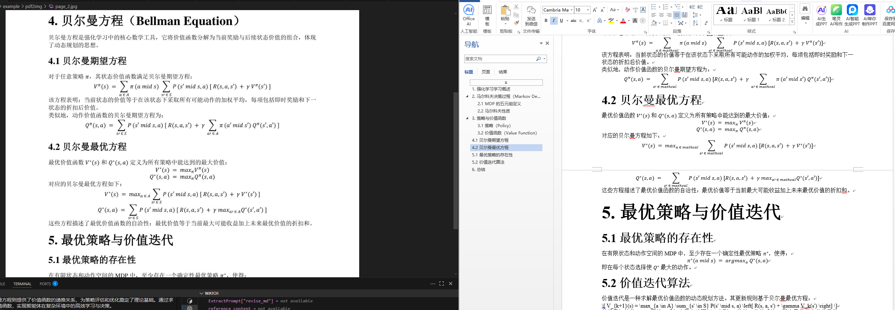

# PDF 转 Markdown 转换器

一个基于 Python 的工具，利用多模态大模型（MLLM）将 PDF 文档转换为结构清晰、格式准确的 Markdown 文件。支持图像提取、Base64 编码、分段保存和可选的内容校正功能，适用于长文档的高精度转换。

---

## 📌 主要功能

- ✅ **PDF 转图像**：使用 `PyMuPDF`（`fitz`）将每页 PDF 高清渲染为图像。
- ✅ **图像转 Markdown**：通过多模态大模型（如 Qwen-VL）识别图像内容并生成结构化 Markdown。
- ✅ **断点续存机制**：每处理 N 页自动保存一次，防止程序中断导致前功尽弃。
- ✅ **图像导出选项**：可选择将 PDF 页面保存为 JPG 图像用于调试或归档。
- ✅ **Markdown 内容校正**：支持使用上下文信息对生成内容进行修订，提升连贯性与格式一致性。
- ✅ **灵活提示词配置**：可通过模板或自定义 prompt 控制模型行为。
- ✅ **指定页码范围**：支持只处理 PDF 的某一部分页面。
- ✅ **双模式修订**：可选择使用 MLLM 多模态模型或纯语言模型（LLM）进行内容修订。

---

## 效果图

<div align="center">
  
  <p><em>图：PDF转makedown效果图</em></p>
</div>

## 🧰 项目结构


确保项目结构如下：

```
SmartGraphQA/
├── Models/
│   ├── vision_models.py      # 多模态模型封装
│   └── LLM_Models.py         # 语言模型封装
├── ExtraTools/
│   └── extractDocument/
│       ├── extractPrompt.py  # 提示词模板
│       └── Pdf2Img2Md.py  # 本工具主文件
```

---

## 🚀 使用示例

```python
from ExtraTools.extractDocument.PDFToMarkdownConverter import PDFToMarkdownConverter

pdf_file = "xxx.pdf"
output_folder = "./out_dir"

converter = PDFToMarkdownConverter(
    pdf_path=pdf_file,
    output_folder=output_folder,
    zoom=2,                    # 渲染缩放倍数，提升清晰度
    mllm_mode="qwen2.5vl_32b", # 使用的多模态模型
    save_md_interval=10,       # 每10页保存一次中间结果
    save_images=True,          # 保存渲染后的图像
    pdf_pages_start=None,      # 起始页码（None 表示从第一页开始）
    pdf_pages_end=50,          # 结束页码（处理前50页）
    use_revise=True,           # 启用内容修订功能
    revise_md_interval=[5, 10],# 每10页用前5页内容辅助修订
    revise_model_mode=None     # 使用 MLLM 自身进行修订（若指定则使用 LLM）
)

# 第一步：将 PDF 转为图像（内存中 Base64 或保存为 JPG）
converter.pdf_to_images()

# 第二步：调用模型生成 Markdown
converter.generate_markdown()
```

### 输出目录结构

运行后会在指定输出文件夹生成以下内容：

```
out_dir/
├── pdf2img/                     # 渲染出的图像（可选）
│   ├── page_1.jpg
│   └── ...
├── markdown/
│   ├── pdf2md_generate.md        # 原始生成的 Markdown
│   └── pdf2md_generate_revise.md # 经过修订的 Markdown（启用时）
```

---

## ⚙️ 参数说明

| 参数名 | 类型 | 说明 |
|--------|------|------|
| `pdf_path` | str | 输入 PDF 文件路径（必填） |
| `output_folder` | str | 输出目录路径（必填） |
| `zoom` | float | 图像渲染缩放比例，默认 `2`（2倍分辨率） |
| `mllm_mode` | str | 多模态模型名称，如 `"qwen2.5vl_32b"` |
| `save_md_interval` | int | 每处理多少页保存一次中间结果 |
| `save_images` | bool | 是否将 PDF 页面保存为 JPG 图像 |
| `prompt_pdf2md` | dict | 自定义图像转 Markdown 的 prompt（含 system/user） |
| `pdf_pages_start`, `pdf_pages_end` | int 或 None | 指定处理的页码范围 |
| `use_revise` | bool | 是否启用 Markdown 内容修订 |
| `prompt_revise_md` | dict | 修订阶段使用的 prompt 模板 |
| `revise_md_interval` | list[int] | `[参考页数, 当前块大小]`，例如 `[5,10]` 表示每10页用前5页辅助修订 |
| `revise_model_mode` | str 或 None | 若为 None 使用 MLLM；否则使用指定语言模型（如 `"qwen3_32b"`） |

---

## 🧠 工作原理

### 1. **PDF → 图像**
使用 `PyMuPDF` 将每一页渲染为高分辨率图像，并转换为 Base64 字符串，供多模态模型输入。

### 2. **图像 → Markdown（MLLM 推理）**
向多模态模型发送：
- 系统提示（任务说明）
- 用户提示（具体指令）
- 图像数据（Base64 编码）

模型返回 Markdown 内容，包含标题、段落、表格、列表等结构。

### 3. **可选：Markdown 内容修订**
为提升跨页内容的一致性：
- 维护一个滑动窗口缓存最近生成的内容。
- 当达到设定间隔时，调用修订模型，传入“前文参考 + 当前内容”。
- 模型优化格式、编号、表格对齐等问题。
- 分段保存修订后的内容。

---

## 📄 提示词模板（Prompt）

提示词来自 `ExtractPrompt` 模块，例如：

```python
ExtractPrompt["pdf2img2md"] = {
        
        'system_prompt':'你是一个可以将图片转换为 Markdown 格式的得力助手。你收到一张图片后，需要将其转换为 Markdown 格式。请仅输出 Markdown 内容，不要包含任何其他文字。',
        'user_prompt':"""你是一个可以将图片转换为 Markdown 格式的得力助手。你收到一张图片后，需要将其转换为 Markdown 格式。请注意：
         1. 分析语义结构，识别正确的标题层级（如章、节、小节，使用对应的 Markdown 标题语法，如#、##、### 等），识别文本样式、公式以及表格行和列的格式
         2. 数学公式应使用 LaTeX 语法转录，确保与原文一致
         3. 禁止提取页码、页眉、页脚等非正文信息，忽略页面边缘的页码、公司 logo、页眉页脚等装饰性内容
         4. 请仅输出 Markdown 内容，不要包含任何其他文字
         5. 任何文字、符号、数字等相互之间不能有空格符号。

         输出示例:
         ```markdown
         {example}
         ```
         """
}


```

你可以通过参数传入自定义 prompt 替代默认模板。

---


## 🛑 已知限制

- 跨页表格可能无法完美拼接。
- 手写体或模糊图像识别准确率下降。
- 所有图像保存在内存中（Base64），处理大文件时内存占用高。
- 依赖私有模型模块，需适配本地环境。

---

## 📎 许可协议

本工具隶属于 `SmartGraphQA` 项目，请参考主仓库的开源协议（通常为 MIT 或 Apache 2.0）。

---

## 📬 联系方式

如有问题或改进建议，请提交 Issue 或联系维护者：

> **tangjun**  
> 邮箱：`tangjun1878@126.com`  


---

📌 *文档更新时间：2025年4月*
