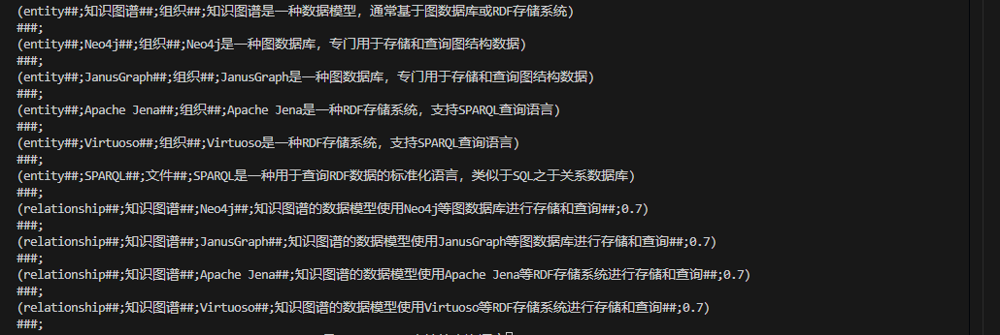
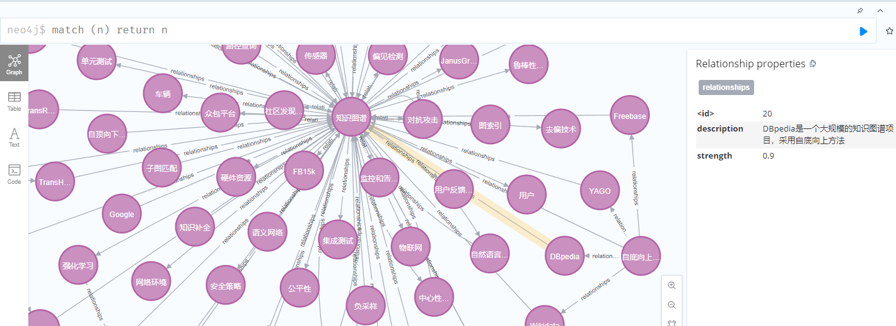
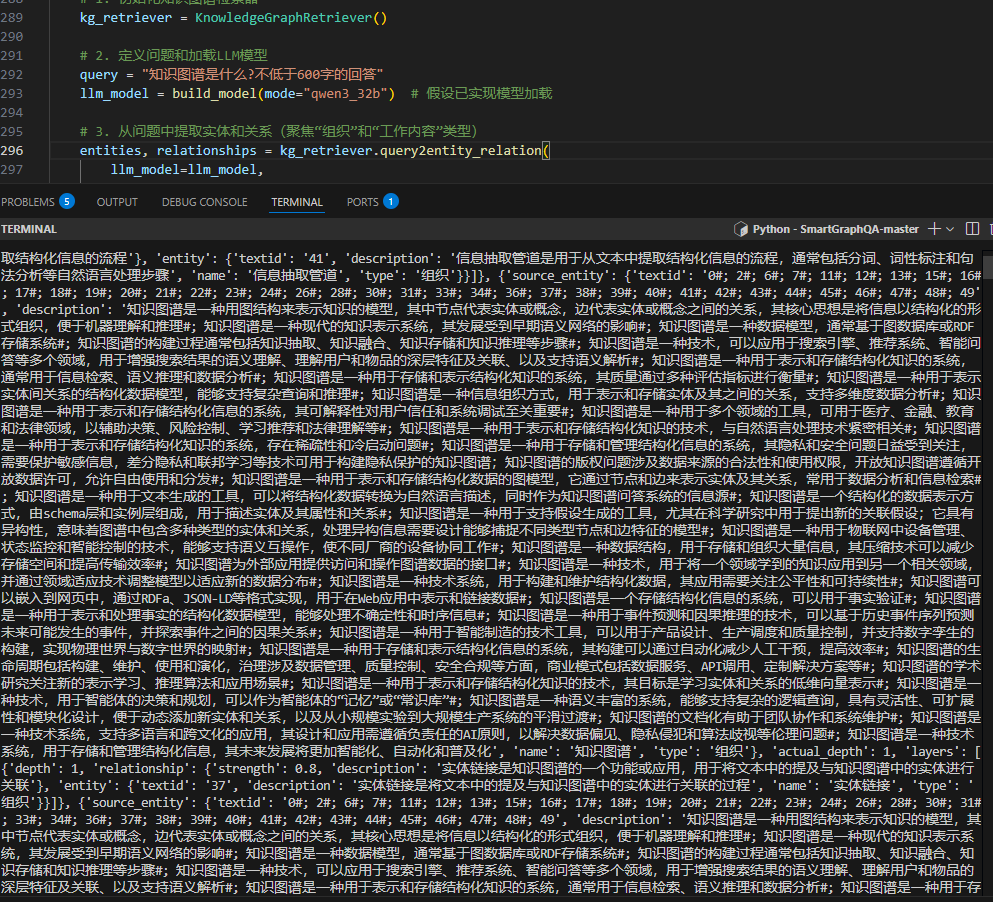
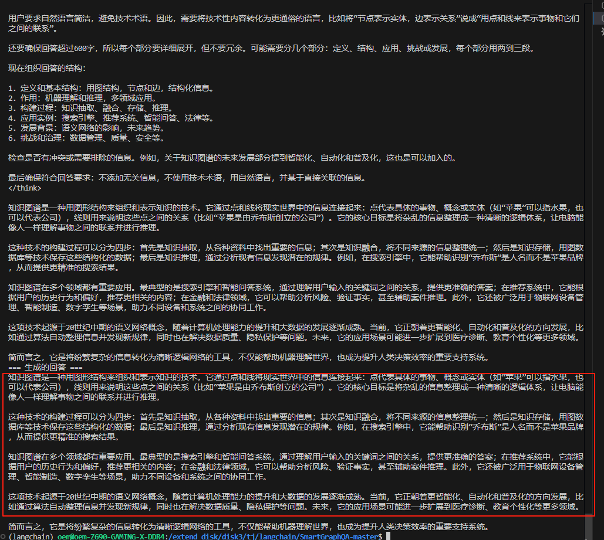

# 🌐 SMARTGRAPHQA —— 轻量级、可扩展的知识图谱问答系统

> 🔍 **让知识图谱构建与检索更简单、更直观、更易用**  
> 一个专为开发者设计的简洁、模块化、高可读性的知识图谱问答框架，支持从文本到图谱构建、再到智能检索与回答生成的全流程自动化。

---

<div align="center">
  
  <p><em>由 <a href="https://blog.csdn.net/weixin_38252409/category_12953981.html">tangjunjun-owen</a> 开发并持续更新</em></p>
</div>

---


## 📖 版本更新记录

### v1.1.0 (2025-9-4)

### v1.1.0 (2025-9-4)

🎉 **重磅新增：PDF 转 Markdown 高精度转换工具（PDFToMarkdownConverter）**

为增强系统对非结构化文档的处理能力，本次更新引入了基于多模态大模型（MLLM）的 `PDFToMarkdownConverter` 工具，显著提升从 PDF 文档提取结构化知识的能力，为后续知识图谱构建提供高质量输入源。

#### ✅ 新增功能亮点：

- **PDF → 图像 → Markdown 全流程自动化**  
  利用 `PyMuPDF` 将 PDF 每页高清渲染为图像，再通过多模态大模型（如 Qwen-VL）识别内容并生成结构化 Markdown，保留标题层级、表格、公式等关键信息。

- **支持图像提取与 Base64 编码**  
  可选择将 PDF 页面保存为 JPG 图像用于调试或归档，同时支持内存中 Base64 编码直接传入模型，减少磁盘 I/O。

- **断点续存机制，保障长文档处理稳定性**  
  支持每处理 N 页自动保存中间结果（如每 10 页），防止程序中断导致前功尽弃，适用于百页以上长文档转换。

- **可选内容校正机制，提升跨页一致性**  
  启用修订功能后，系统将使用滑动窗口缓存历史内容，结合上下文对当前段落进行格式优化和语义连贯性修正，解决编号断裂、表格错位等问题。

- **双模式修订支持**  
  支持使用 MLLM 多模态模型自身修订，或切换至高性能语言模型（LLM）进行纯文本优化，灵活适配资源与精度需求。

- **灵活提示词配置**  
  提供默认 prompt 模板，支持自定义 system/user prompt，精确控制模型输出风格与结构要求。

- **指定页码范围处理**  
  可仅处理 PDF 的某一部分页面（如前 50 页），便于分段处理或调试。

详情请参考makedown链接：[点击这里](./ExtraTools/extractDocument/readme.md)


## 🎯 项目愿景

在研究了阿里KAG、GraphRAG、LightRAG等开源项目后，我发现这些系统虽然功能强大，但普遍存在**代码复杂、结构耦合、难以二次开发**的问题。因此，我决定打造一个：

✅ **简洁清晰**  
✅ **模块化设计**  
✅ **易于扩展与二次开发**  
✅ **支持垂直领域定制化**

的轻量级知识图谱问答系统 —— **SMARTGRAPHQA**。

我们致力于：
- ✅ 解决大模型“幻觉”问题
- ✅ 弥补向量检索中“信息割裂”的局限
- ✅ 实现 **知识图谱 + 向量数据库** 双引擎联动检索
- ✅ 构建真正可靠、可解释的智能问答系统

---

## 📚 项目博客 & 社区交流

📌 持续更新项目细节、技术解析与实战案例，请访问我的 CSDN 专栏：  
👉 [https://blog.csdn.net/weixin_38252409/category_12953981.html](https://blog.csdn.net/weixin_38252409/category_12953981.html)

💬 欢迎交流学习，欢迎 PR 与 Issue！

---

## 🗂️ 项目目录结构（模块化设计）

```

SMARTGRAPHQA-MASTER/
├── __init__.py                           # 模块入口，导出核心类与函数
├── DataBase/                             # 数据库核心功能组件
│   ├── __init__.py                       # 导出 GraphData、MilvusData 等
│   ├── GraphData                         # Neo4j 图数据库操作模块
│   │   └── create_graph_knowledge.py     # 知识图谱构建核心逻辑
│   ├── MilvusData                        # 向量数据库模块（待集成）
│   │   └── ***.py                        # 已实现但未集成
│   ├── config.py                         # 配置文件：Neo4j连接、模型API等
│   └── prompt_utils.py                   # 提示词处理工具函数
├── Prompts/                              # 提示词管理
│   ├── __init__.py                       # 导出提示词模板
│   └── prompt_graph.py                   # 图谱抽取提示词（基于GraphRAG翻译优化）
├── Models/                               # 多模型接口封装
│   ├── __init__.py                       # 统一导出模型接口
│   ├── Embed_Models.py                   # Embedding模型（OpenAI、本地服务等）
│   ├── LLM_Models.py                     # 大语言模型调用接口
│   ├── vision_Models.py                  # 多模态模型支持
│   └── model_utils.py                    # 模型通用工具函数
├── ExtraTools/
│   └── extractDocument/
│       ├── extractPrompt.py              # 提示词模板
│       └── Pdf2Img2Md.py                 # PDF转Markdown主工具
├── main_GraphBuild.py                    # 主函数：知识图谱构建入口
└── main_GraphRetriever.py                # 主函数：知识图谱检索与问答入口
```

> 📌 **当前重点：知识图谱构建与检索**  
> 📌 **未来规划：集成 Milvus 向量库，实现 RAG + KG 联动检索**

---

## 🧩 核心功能

### 1️⃣ 自动化知识图谱构建

从非结构化文本中自动提取知识三元组，并存入图数据库。

#### ✅ 支持能力：
- 从 `.txt` 文件读取原始文本
- 使用大模型（如 Qwen）抽取实体与关系
- 自动解析为结构化 `(头实体, 关系, 尾实体)` 三元组
- 写入 Neo4j 图数据库，形成可视化知识网络

#### 🔧 技术栈概览

| 组件 | 作用 |
|------|------|
| **Qwen-14B / Qwen-32B** | 中文大模型，用于实体与关系抽取 |
| **LangChain** | 构建提示词、调用 LLM 接口 |
| **Neo4j** | 图数据库，存储实体与关系 |
| **自定义模块** | 输出解析、图谱写入、错误处理 |

---

### 🚀 四步构建流程

```python
# 1. 读取文本
text = read_file("example_data.txt")
lines = [line.strip() for line in text.splitlines() if line.strip()]

# 2. 构建提示词
prompt = build_prompt(text, entity_types="组织、人物、文件")

# 3. 调用大模型
response = llm.invoke(prompt)
response = remove_think(response)  # 清理冗余思考内容

# 4. 解析并写入图谱
entities, relationships = parser.batch_parse_data({"graph_text": response})
graph.write_entities_and_relationships(entities, relationships)
```

<div align="center">
  
  <p><em>图：知识图谱构建流程</em></p>
</div>

<div align="center">
  
  <p><em>图：Neo4j 中构建的知识图谱可视化效果</em></p>
</div>

---

## 🔍 知识图谱智能检索与问答

### 🧠 整体架构流程

```
用户提问
   ↓
大模型抽取问题中的关键实体
   ↓
Neo4j 查询实体及其多跳关联信息
   ↓
结合图谱上下文生成自然语言回答
```

#### ✅ 核心优势：
- 利用图结构挖掘深层语义关系（如“阿里巴巴 → 阿里云 → 通义实验室”）
- 减少大模型幻觉，提升回答准确性
- 支持多跳推理与路径分析

---

### 🧱 核心类：`KnowledgeGraphRetriever`

| 方法 | 功能说明 |
|------|----------|
| `generate_entity_relation()` | 调用 LLM 抽取输入文本中的实体与关系 |
| `parse_from_generate_entity_relation()` | 解析模型输出为结构化数据 |
| `query_neo4j_by_entity(entity_name, max_depth=2)` | 查询实体及多层邻居（支持深度控制） |
| `generate_answer(question, kg_info)` | 基于图谱信息生成自然语言回答 |

---

### 🚀 四步检索流程

#### 第1步：实体关系抽取

```python
entities, relationships = kg_retriever.query2entity_relation(
    llm_model=llm_model,
    input_text="阿里巴巴有哪些子公司？",
    entity_type="组织、人物、文件"
)
```

📌 模型输出示例：
```
(entity|阿里巴巴|组织|中国领先的互联网公司)
(relationship|阿里巴巴|投资|阿里云|战略合作)
```

---

#### 第2步：结构化解析

```python
def parse_from_generate_entity_relation(self, data):
    # 按行分割，提取三元组
    return entities, relationships
```

✅ 输出结构：
```python
entities = [
    {"entity_name": "阿里巴巴", "entity_type": "组织", "description": "中国领先的互联网公司"}
]

relationships = [
    {
        "source_entity": "阿里巴巴",
        "target_entity": "阿里云",
        "relationship_description": "战略合作",
        "relationship_strength": 0.95
    }
]
```

---

#### 第3步：图数据库多跳查询

```python
kg_info = kg_retriever.query_neo4j_by_entity(
    entity_name="阿里巴巴",
    max_depth=2  # 支持两跳查询
)
```

🧠 返回格式（支持多路径、多跳）：

```json
[
  {
    "source_entity": { "name": "阿里巴巴", "type": "组织", "description": "..." },
    "actual_depth": 2,
    "layers": [
      {
        "depth": 1,
        "relationship": { "type": "投资", "description": "全资控股" },
        "entity": { "name": "阿里云", "type": "组织" }
      },
      {
        "depth": 2,
        "relationship": { "type": "研发", "description": "核心技术团队" },
        "entity": { "name": "通义实验室", "type": "组织" }
      }
    ]
  }
]
```

> 🔍 支持配置 `max_depth` 实现灵活的深度查询

---

#### 第4步：生成自然语言回答

```python
answer = kg_retriever.generate_answer(
    llm_model=llm_model,
    question="阿里巴巴有哪些子公司？",
    entity_name="阿里巴巴",
    kg_info=kg_info
)
```

💡 **提示词优化策略**：
- 明确要求优先使用图谱中的直接关联信息
- 禁止编造未出现在图谱中的关系
- 对冲突信息采用“投票机制”（出现频率高的优先保留）
- 输出格式统一为简洁自然语言

---

<div align="center">
  
  <p><em>图：知识图谱检索流程</em></p>
</div>

<div align="center">
  
  <p><em>图：最终生成的自然语言回答示例</em></p>
</div>

---

## 📦 数据格式规范

### ✅ 实体格式（Entity）

```python
{
    "entity_name": "阿里巴巴",
    "entity_type": "组织",
    "entity_description": "中国领先的互联网科技公司",
    **metadata  # 其他自定义字段（如成立时间、行业等）
}
```

> 📌 必填字段：`name`, `type`, `description`  
> 📌 扩展字段通过 `metadata` 字典传入

---

### ✅ 关系格式（Relationship）

```python
{
    "source_entity": "阿里巴巴",
    "target_entity": "阿里云",
    "relationship_description": "投资并控股",
    "relationship_strength": 0.95  # 可选：关系置信度
}
```

> 📌 必填字段：`source_entity`, `target_entity`, `relationship_description`

---

### ✅ 检索返回格式（Graph Query Result）

```json
[
  {
    "source_entity": { "name": "阿里巴巴", "type": "组织", "description": "..." },
    "actual_depth": 2,
    "layers": [
      {
        "depth": 1,
        "relationship": { "type": "投资", "description": "全资子公司" },
        "entity": { "name": "阿里云", "type": "组织" }
      },
      {
        "depth": 2,
        "relationship": { "type": "孵化", "description": "内部创新项目" },
        "entity": { "name": "通义实验室", "type": "组织" }
      }
    ]
  }
]
```

> 支持多路径、多跳结果返回，便于后续推理与展示

---

## 🔮 未来规划

| 功能 | 状态 | 说明 |
|------|------|------|
| ✅ 知识图谱构建 | 已完成 | 支持文本 → 三元组 → Neo4j |
| ✅ 图谱检索与问答 | 已完成 | 支持多跳查询与自然语言生成 |
| 🔜 Milvus 向量库集成 | 开发中 | 实现文本向量化与相似性检索 |
| 🔜 RAG + KG 联动检索 | 规划中 | 结合向量检索与图谱推理，提升召回与准确性 |
| 🔜 Web 可视化界面 | 规划中 | 提供前端交互界面，支持图谱浏览与问答 |
| 🔜 领域 Prompt 定制模板 | 规划中 | 支持医疗、金融、法律等垂直领域快速适配 |

---

## 🛠️ 开发者友好设计

| 特性 | 说明 |
|------|------|
| **模块化接口** | 支持 HuggingFace、vLLM、Ollama、OpenAI 等多种模型调用方式 |
| **提示词可配置** | 所有 Prompt 存放于 `Prompts/` 目录，便于领域定制 |
| **高可读性代码** | 注释清晰、函数职责单一、易于理解与二次开发 |
| **配置集中管理** | 所有参数在 `config.py` 中统一配置 |
| **错误处理完善** | 包含日志记录、异常捕获、重试机制 |

---

## 🤝 贡献与交流

欢迎任何形式的贡献！

- 🐞 提交 Issue：报告 Bug 或提出功能建议
- 💡 提交 PR：优化代码、新增功能、完善文档
- 📣 分享使用经验：在博客评论区或 GitHub 讨论区交流

---

## 📜 许可证

本项目采用 [MIT License](LICENSE) 开源协议，欢迎自由使用与修改。

---

## 🙏 致谢

感谢以下开源项目的技术启发：
- [GraphRAG](https://github.com/microsoft/graphrag)
- [LightRAG](https://github.com/HKUDS/LightRAG)
- [LangChain](https://github.com/langchain-ai/langchain)
- [OpenSPG](https://github.com/OpenSPG/KAG)
- [Neo4j](https://neo4j.com/)
- [Milvus](https://milvus.io/)

---

> 🌟 **SMARTGRAPHQA —— 让知识图谱真正“聪明”起来**  
> 一个为开发者而生的轻量级、可扩展、易理解的知识图谱问答系统。  
> 现在就开始构建你的专属知识大脑吧！